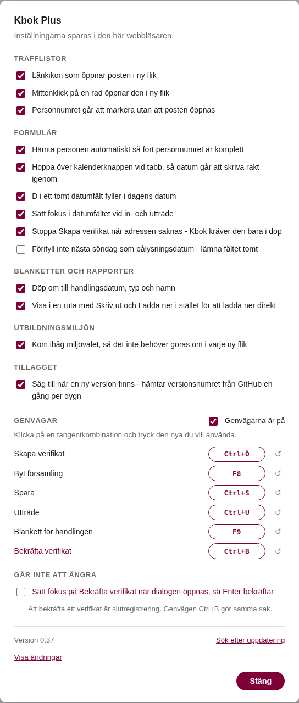
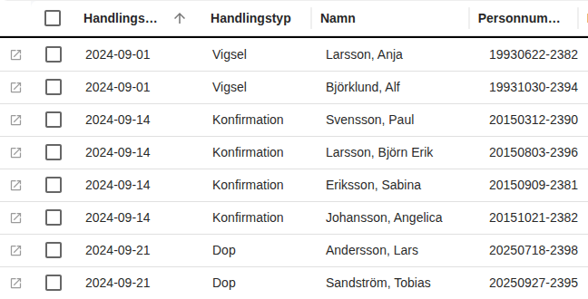
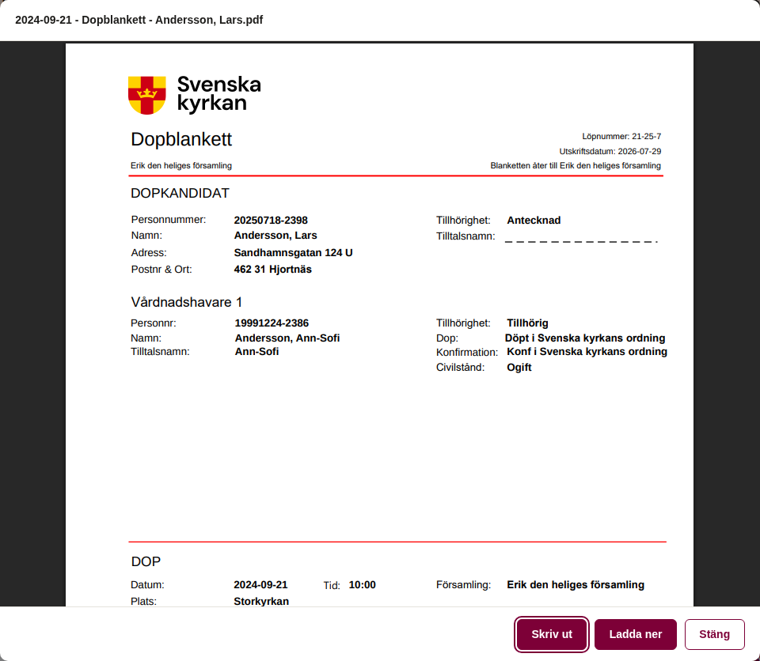
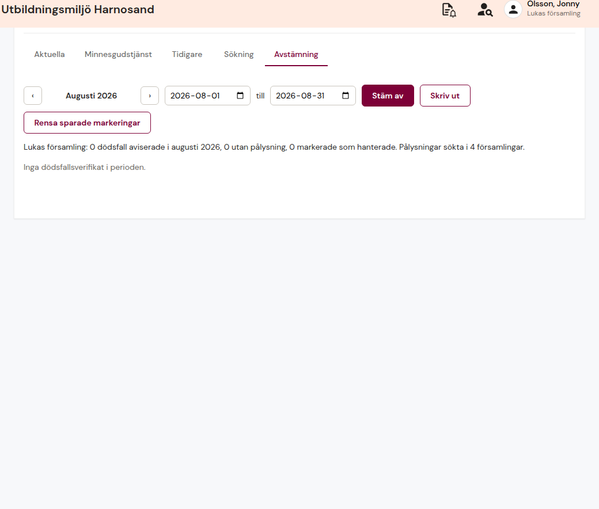

# Kbok Plus

Ett tillägg till Kbok, Svenska kyrkans kyrkobokföringssystem. Det lägger
till länkar, genvägar och några spärrar som Kbok saknar, och tar bort en
del av det motstånd som webbklienten har och desktopklienten inte hade.

Tillägget ändrar ingenting i Kbok självt. Allt körs i din egen webbläsare
och går att stänga av, funktion för funktion.
Det som tillägget behöver minnas sparas i webbläsaren, aldrig någon
annanstans, och inget med personuppgifter ligger kvar efter att du loggat ut.

## Installera

1. Installera **Tampermonkey** i webbläsaren
   ([Chrome](https://chromewebstore.google.com/detail/tampermonkey/dhdgffkkebhmkfjojejmpbldmpobfkfo),
   [Edge](https://microsoftedge.microsoft.com/addons/detail/tampermonkey/iikmkjmpaadaobahmlepeloendndfphd),
   [Firefox](https://addons.mozilla.org/sv-SE/firefox/addon/tampermonkey/)).
2. Öppna
   [svk-kbok-enhancements.user.js](https://raw.githubusercontent.com/armandur/svk-kbok-enhancements/main/svk-kbok-enhancements.user.js).
   Tampermonkey känner igen filen och visar sin egen installationsdialog.
3. Ladda om Kbok.

Inställningarna hittar du som **✚ Kbok Plus** i menyn under avataren uppe
till höger, tillsammans med Byt församling och Inställningar.

## Vad du får

| Funktion | Beskrivning | Standard |
| --- | --- | --- |
| Öppna i ny flik | Länkikon i varje rad i personlistorna. Vanligt klick, mittenklick och högerklickmenyns Öppna i ny flik fungerar alla, eftersom ikonen är en riktig länk. Mittenklick var som helst på raden gör samma sak. | På |
| Auto-hämta person | Klickar Hämta åt dig så fort ett komplett personnummer skrivits eller klistrats in i ett personnummerfält - relationspersoner och Inträde. | På |
| Hoppa över datumväljaren | Tabb går från datumfältet vidare i formuläret i stället för in i kalenderknappen. | På |
| Markerbart personnummer | Gör personnumret i listorna markerbart, så det går att dra över och kopiera utan att posten öppnas. | På |
| D för dagens datum | `D` i ett tomt datumfält fyller i dagens datum, som i desktopklienten. | På |
| Filnamn på blanketter | Döper nedladdade blanketter och bevis efter handlingsdatum, typ och namn i stället för bara typen. | På |
| Minns miljövalet | Fyller i senast valda miljön i Utbildningsmiljön, så den inte behöver väljas om i varje ny flik. | På |
| Visa blanketten i stället | Visar PDF:en i en ruta med Skriv ut och Ladda ner, i stället för att ladda ner den direkt. | **Av** |
| Adress krävs för verifikat | Stoppar **Skapa verifikat** när adressen saknas i konfirmation, vigsel, välsignelse eller begravning. Kbok kräver den bara i dop. | På |
| Tomt pålysningsdatum | Låter bli att förifylla nästa söndag, så datumet skrivs in själv. Desktopklienten lät en välja. | **Av** |
| Skriv ut verifikat | Utskriftsikon på ett öppnat verifikat, och utskrift på en sida i stället för flera med tomma ark. Gäller även webbläsarens Ctrl+P. | På |
| Avstämning av tacksägelser | Fliken **Avstämning** i Pålysningsboken visar vilka avlidna som saknar pålysning för vald månad, med länk till varje pålysning som finns. Förvald månad är den föregående. | På |
| Tangentbordsgenvägar | Se nästa avsnitt. Varje genväg går att spela in på nytt i inställningarna. | På |
| Fokus på Bekräfta verifikat | Sätter fokus på knappen när verifikatdialogen öppnas, så Enter bekräftar - som i desktopklienten. | **Av** |

Länkikonen ligger först på varje rad, och öppnar posten dit ett dubbelklick
hade tagit dig - i Ministerialboken själva handlingen, inte bara
personakten:

Med **Visa blanketten i stället** påslaget öppnas blanketten i en ruta med
Skriv ut och Ladda ner. Namnet högst upp är det filen får om du laddar ner
den:

Fliken **Avstämning** i Pålysningsboken ställer månadens dödsfallsverifikat
mot pålysningarna i alla dina församlingar. Den som saknar pålysning står
först. Kryssa **Hanterad** när något är omhändertaget på annat sätt, till
exempel att anhöriga avböjt tacksägelse - markeringen sparas i din egen
webbläsare och rensas efter ett år:

## Genvägar

| Tangent | Gör | I gamla Kbok |
| --- | --- | --- |
| `Ctrl + S` | Spara | `Ctrl + S` - blockerar webbläsarens Spara sidan |
| `Ctrl + Ö` | Skapa verifikat | `Ctrl + W`, som i webbläsaren stänger fliken |
| `Ctrl + U` | Utträde | `Ctrl + U` - blockerar webbläsarens Visa källkod |
| `F8` | Byt församling | `F8` |
| `F9` | Blankett för handlingen man står i | Fanns inte |
| `Ctrl + B` | **Bekräfta verifikat** - slutregistrering, går inte att ångra | Fanns inte |

Klicka på en tangentkombination i inställningarna och tryck den nya du vill
ha. Återställningspilen tar tillbaka standardvärdet.

## Uppdateringar

Tampermonkey letar själv efter nya versioner och erbjuder uppdatering när
det finns en. Tillägget säger dessutom till med en ruta, högst en gång per
dygn, och kan visa vad som ändrats innan du uppdaterar.

**Nyheten syns inte direkt.** GitHub svarar med föregående innehåll i upp
till fem minuter efter att en ny version lagts ut. Ser du inte den version
som just släppts är det nästan alltid det som gäller - vänta en stund och
försök igen.

## Läs mer

- [CHANGELOG.md](CHANGELOG.md) - vad som ändrats i varje version
- [Dokumentation.md](Dokumentation.md) - hur tillägget är byggt, varför
  lösningarna ser ut som de gör, och de fällor i Kbok som kartlades på
  vägen
- [svk-kob-enhancements](https://github.com/armandur/svk-kob-enhancements) -
  samma upplägg för Kob
